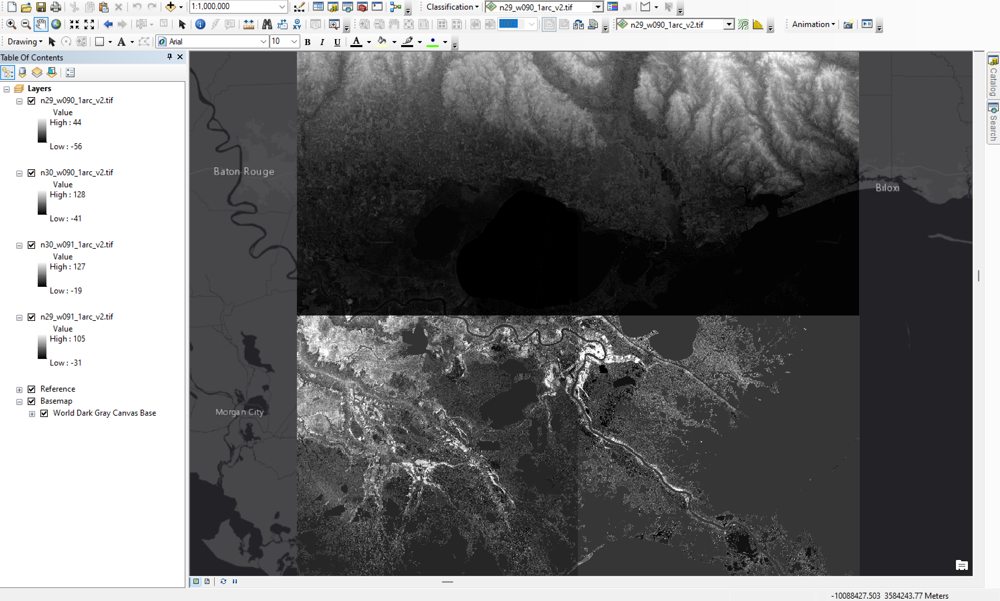
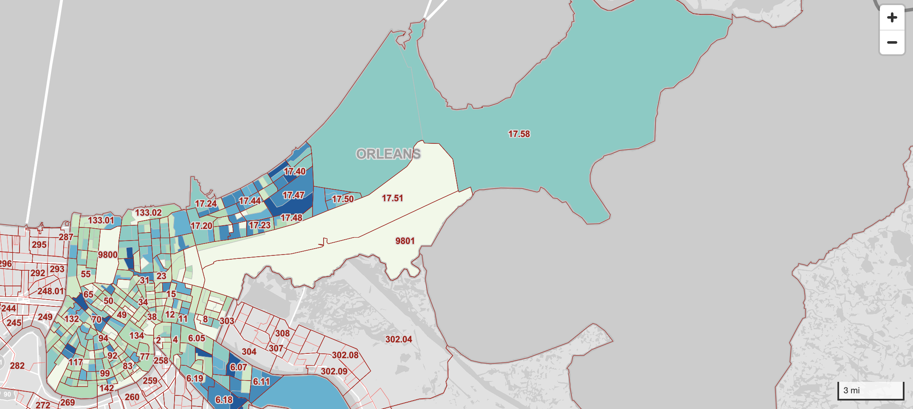

# New Orleans Flood Mapping Project (Post Hurricane Data Analysis)

## Introduction

&emsp;For our project we will examine hurricane flooding in New Orleans. New Orleans is located just off of the Gulf of Mexico, a tropical storm generating body of water. Due to New Orleans location, and its general topography being relatively low with some areas below sea level, it is very vulnerable to hurricanes. In 2005, the city was hit by Hurricane Katrina, (facts here, discuss displacement and destruction). With the onset of global warming causing more extreme weather events around the world, it becomes increasingly important to equip cities like New Orleans with tools to mitigate and respond to these natural disasters which may become more frequent and intense with time. Using our skills as cartographers, we aim to examine the city and the risk posed by future hurricanes to provide a tool for potential damage mitigation and emergency response development.

&emsp;The intended audience of the project are residents of the area, and also any emergency responding groups. City and state offices and policy-makers are likewise an important audience as a powerful agent in enacting fiscally sourced change such as infrastructure development.

&emsp;Positive impacts of the project are better preparing residents of New Orleans for future hurricanes, as well as giving policy-makers and emergency responders better tools to understand the nature of hurricanes and flooding in New Orleans to better protect the population and reduce damage and risk to public safety. Impacts could also include the development of new infrastructure to better aid in emergency situations.
Negative impacts could include policy-makers choosing to invest less in zones deemed at high risk for flooding, which could worsen socio-economic disparities in the city and put lives at greater risk. We could attempt to avoid this by emphasizing the need to invest in higher risk zones to bring down overall risk in the city.

## Work-In-Progress Notes

For the entirety of each map, they will add onto the last map. So for the storymap itself, in order to get the flow of the story in sync, there is no need to have multiple base map. Since the area of land is consistent and we will be focusing on the entire area of New Orleans. 

In terms of maps we are working on. The data for the Evacuation and Preventative Measures Layer is being collected and will be generated by us, by grabbing the POIs and the longitude and latitude for those areas.
Once the data is collected it will just be about labeling, so as of right now there isn't a map for that since the dataset is still be created.

The other two maps have progress below.

### Risk Zone Development:

So far we've gathered digital elevation data from SRTM and overlaid the raster tiles upon a basemap (shown above). Next steps will include researching flood water levels during past hurricanes in New Orleans to develop risk level categories and conditional elevation raster layers based on those categories. Another layer of New Orleans plots will then be overlaid, and seperate SQL statements will be employed for each risk level to dtermine which plots intersect with each risk levels conditional raster data, effectively identifying which plots are at higher risk to flood damage based on elevation.

### Population Census Data:

In terms of the census data map, we have overlaid created a thematic map showing the census data and overlaid it up on the basemap. Next steps will include adding the toopltip and more interactive aspects as well as adding the census wealth of each area into the tooltip. Since right now it is just a thematic map that shows the population, where the darker colors are higher population and the lighter is less, so with the tooltip, we will be able to understand that as well as the wealth. Now this is just an option, but we could add another layer to show the weath of each block, but that might be showing too much and in seaprate views. Like since we want to compare the two aspects. 

## Data Sources

### Definite:

* [Highway access](https://uw.maps.arcgis.com/home/item.html?id=9c18cd35071d43afb96f0eb30901138f) - for use in evacuation map

* Nola Hurricane water level increase and flood data - for developing risk zone levels

* SRTM elevation data - for use in applying flood risk zones to New Orleans (assets)

* New Orleans lot data - for development of flood risk map, sourced from [New Orleans Open Data](https://data.nola.gov/dataset/Lots/m5br-772y) (assets)

* [NOLA population by block group](https://data.census.gov/cedsci/table?q=census%20tract&t=Populations%20and%20People&g=0500000US22071%241500000&tid=ACSDT5Y2020.B01003) - population analysis

* [Nola neighborhood boundaries](https://data.nola.gov/Geographic-Base-Layers/Neighborhood-Statistical-Areas/c2j2-5qdf) - neighborhood blocks

* [Nola Storm Surge](https://ready.nola.gov/hazard-mitigation/hazards/storm-surge-and-coastal-flooding/#:~:text=The%20damages%20caused%20by%20Hurricane%20Katrina%20demonstrate%20that,the%20south%20shore%20in%20Jefferson%20and%20Orleans%20Parishes) - Risk zone development (flood levels)

